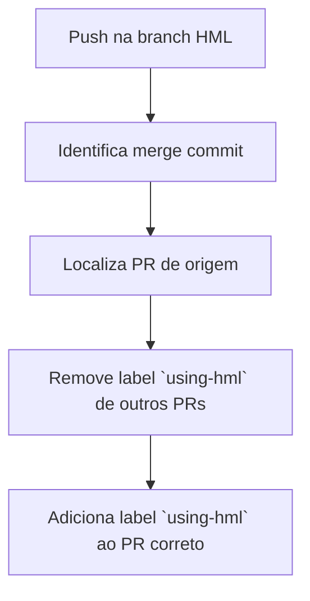

# Controle de PRs Mergeados na Branch HML

Este repositório apresenta uma **proposta de melhoria** no fluxo de integração de PRs na branch `hml`.  
A ideia é automatizar a **identificação de PRs mergeados** e garantir visibilidade e unicidade através da label `using-hml`.

---

## Objetivos

1. Identificar automaticamente PRs mergeados em `hml`.
2. Adicionar a label `using-hml` ao PR correspondente.
3. Garantir que **apenas um PR por vez** tenha a label `using-hml`.
4. Melhorar visibilidade para o time sobre quais PRs já foram integrados à HML.

---

## Como funciona o fluxo

O workflow dispara **sempre que há um push na branch `hml`**:

### Benefícios

1. Visibilidade clara de PRs integrados à HML.

2. Workflow totalmente automático, sem intervenção manual.

3. Facilita auditoria e acompanhamento do progresso do time.

### Como testar 

crie uma branch a partir da `main`, abra um `pull request` pra `main` e por fim faça o merge dessa branch em `hml`

o PR deve ser marcado com a label `using-hml` e a mesma deve ser removida de outros PRs