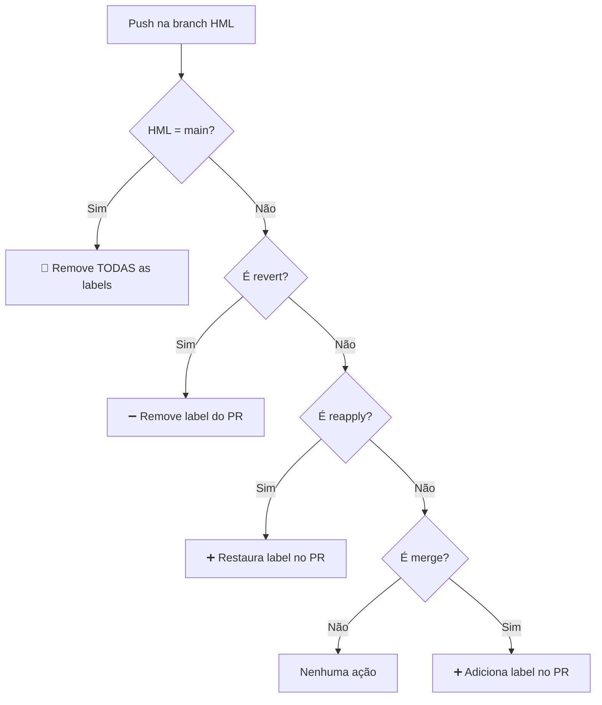

# 🏷️ Controle de PRs na Branch HML

Automação para gerenciamento de labels `using-hml` em Pull Requests mergeados na branch de homologação.

---

## 🎯 O que faz?

- ➕ **Adiciona** a label `using-hml` quando uma feature é mergeada em `hml`
- ➖ **Remove** a label quando um merge é revertido
- 🔄 **Restaura** a label quando um revert é desfeito (reapply)
- 🧹 **Reseta** todas as labels quando `hml` é sincronizada com `main`

---

## 📊 Fluxo de Decisão



---

## 📋 Cenários

| Ação | Resultado |
|:-----|:----------|
| Merge de `feature-a` em `hml` | ➕ Adiciona `using-hml` no PR |
| Merge de `feature-b` em `hml` | ➕ Adiciona `using-hml` (PRs anteriores **mantêm** a label) |
| Force push `main` → `hml` | 🧹 Remove `using-hml` de **todos** os PRs |
| Revert de um merge | ➖ Remove `using-hml` do PR revertido |
| Reapply (desfaz revert) | ➕ Restaura `using-hml` no PR |

---

## ✨ Benefícios

| | |
|:--|:--|
| 👁️ **Visibilidade** | Saiba quais PRs estão em HML |
| 🔀 **Concatenação** | Múltiplos PRs podem coexistir em HML |
| 🔄 **Flexibilidade** | Reverts e reapplies são tratados automaticamente |
| 🤖 **Zero intervenção** | Totalmente automático |

---

## 🧪 Como Testar

### Adicionar um PR ao HML

```bash
# 1. Crie uma branch e faça alterações
git checkout -b feat/minha-feature
# ... faça suas alterações ...
git push origin feat/minha-feature

# 2. Abra um PR para main no GitHub

# 3. Merge a branch em hml
git checkout hml
git merge feat/minha-feature
git push origin hml
```

✅ O PR será marcado com `using-hml`

---

### Concatenar múltiplos PRs

Repita o processo para várias branches. Todos os PRs terão a label `using-hml`.

---

### Resetar o ambiente HML

```bash
git push --force origin main:hml
```

✅ Todas as labels `using-hml` serão removidas

---

### Reverter um merge

```bash
git checkout hml
git revert -m 1 <hash-do-merge-commit>
git push origin hml
```

✅ A label será removida do PR correspondente

---

### Reaplicar um merge revertido

```bash
git checkout hml
git revert <hash-do-commit-de-revert>
git push origin hml
```

✅ A label será restaurada no PR

---

## 📁 Estrutura

```
.github/workflows/
├── deploy-hml.yml              # Dispara no push para hml
└── apply-using-hml-label.yml   # Gerencia as labels
```

| Workflow | Responsabilidade |
|:---------|:-----------------|
| `deploy-hml.yml` | Executa deploy e aciona o workflow de labels |
| `apply-using-hml-label.yml` | Detecta tipo de commit e gerencia labels |
