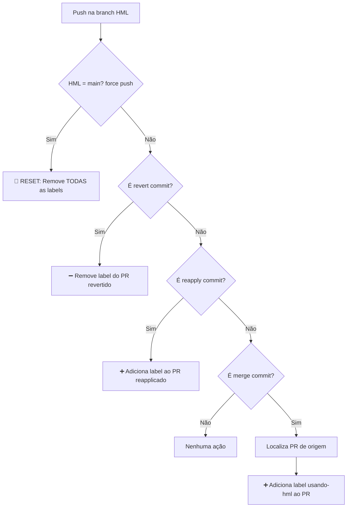

# Controle de PRs Mergeados na Branch HML

Este repositório apresenta uma **automação** no fluxo de integração de PRs na branch `hml`.  
A ideia é automatizar a **identificação de PRs mergeados** e garantir visibilidade através da label `using-hml`.

---

## Objetivos

1. Identificar automaticamente PRs mergeados em `hml`.
2. Adicionar a label `using-hml` ao PR correspondente.
3. Permitir **múltiplos PRs** com a label `using-hml` (concatenação de implementações).
4. Resetar o ambiente removendo todas as labels via **force push** da main.
5. Remover a label de PRs revertidos.

---

## Como funciona o fluxo

O workflow dispara **sempre que há um push na branch `hml`**:



---

## Cenários

| Ação | Resultado |
|------|-----------|
| Merge de `feature-a` em `hml` | ➕ Adiciona `using-hml` no PR da feature-a |
| Merge de `feature-b` em `hml` | ➕ Adiciona `using-hml` no PR da feature-b (feature-a **mantém** a label) |
| **Force push da main em hml** | 🔄 Remove `using-hml` de **todos** os PRs (reset do ambiente) |
| Revert do merge de `feature-a` | ➖ Remove `using-hml` **apenas** do PR da feature-a |
| Reapply (revert do revert) de `feature-a` | ➕ Adiciona `using-hml` de volta no PR da feature-a |

---

## Benefícios

1. **Visibilidade clara** de PRs integrados à HML.
2. **Múltiplos PRs** podem estar em HML simultaneamente (concatenação de features).
3. **Reset fácil** do ambiente via force push.
4. **Reverts tratados** automaticamente, removendo a label do PR revertido.
5. Workflow totalmente automático, sem intervenção manual.

---

## Como testar

### Adicionar label a um PR
1. Crie uma branch a partir da `main`
2. Abra um `pull request` para `main`
3. Faça o merge dessa branch em `hml`
4. ✅ O PR será marcado com a label `using-hml`

### Concatenar múltiplos PRs em HML
1. Repita o processo acima para múltiplas branches
2. ✅ Todos os PRs mergeados terão a label `using-hml`

### Resetar o ambiente HML

```bash
git push --force origin main:hml
```

✅ Todas as labels `using-hml` serão removidas

### Reverter um merge
1. Faça revert de um merge commit em `hml`
2. ✅ A label `using-hml` será removida apenas do PR correspondente

### Reaplica um merge revertido
1. Faça revert do commit de revert (reapply)
```bash
git revert <hash-do-commit-de-revert>
```
2. ✅ A label `using-hml` será adicionada de volta ao PR

---

## Estrutura dos Workflows

### `deploy-hml.yml`
- Dispara no push para `hml`
- Executa o deploy (fake neste exemplo)
- Aciona o workflow de labels

### `apply-using-hml-label.yml`
- Detecta o tipo de commit (reset/force push, revert, merge de feature)
- Aplica ou remove labels conforme o cenário
